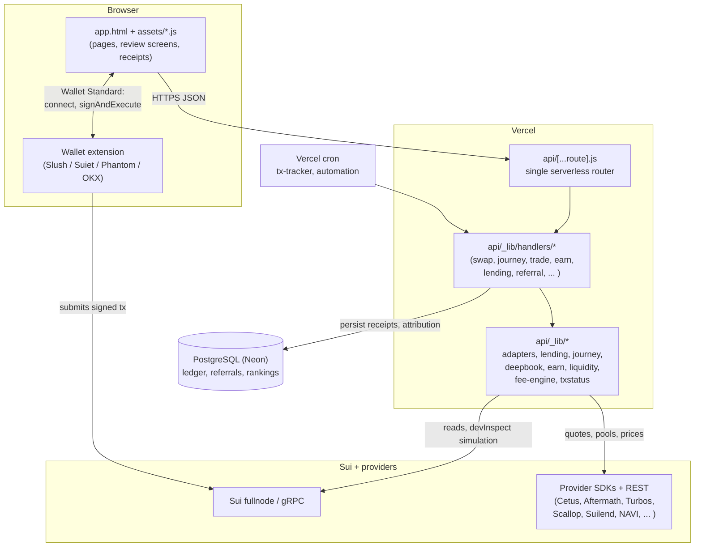

# Architecture

This document describes the system as implemented. Component names match the repository layout.

## Overview

Key point: the wallet submits the transaction to the network itself (inside `signAndExecuteTransaction`). The backend never holds a signed transaction and never submits on the user's behalf.

## Frontend and routing

- `app.html` is the application. Sidebar pages (`home`, `swap`, `deposit`, `manage`, `trade`, `earn`, `actions`, `capital`, `referral`, `leaderboard`, `community`, `activity`, `discover`, `security`, `settings`, `ai`) are `div.page` sections toggled by `navigateTo(pageId)`.
- `assets/journey.js` drives swap / place-funds / exit review and signing. `assets/tasks.js` renders provider comparison cards. `assets/referrals.js` drives referral and leaderboard reads.
- Signing layer (`window.HubWallet`, top of `app.html`): connects via `standard:connect`, re-simulates through the backend immediately before invoking the wallet, checks the digest matches the reviewed transaction, and surfaces rejection events. A wallet picker lists every detected Sui wallet by name.
- `index.html` is the landing page; `admin.html` is a key-gated admin console (session key only).

## API and backend

- One serverless entry (`api/[...route].js`) dispatches to `api/_lib/handlers/*` by path. Function limit: 60 s, 1024 MB (`vercel.json`).
- Handlers validate input with fail-closed errors, call `api/_lib/*` builders, and return unsigned `txBytes` plus simulation output. Nothing is pre-signed server-side.
- Notable libraries: `journey.js` (atomic swap→deposit, withdrawals, receipts), `lending.js` (Suilend/NAVI/Scallop/Haedal/SpringSui/Volo/Metastable/Bucket builders plus gRPC/JSON clients), `adapters.js` (Cetus/Aftermath swap adapters, route ranking), `deepbook*.js` (spot + predict), `earn.js` (native + Aftermath staking), `liquidity.js` (STEAMM pools), `fee-engine.js` (2 bps router fee accounting), `txstatus.js` (receipt polling).

## Provider adapters and protocols

Each integration has a scoped adapter: market-data reads, quote generation where supported, unsigned PTB construction, and `devInspect` simulation. The authoritative capability list is `shared/registry.js` (20 scoped entries); the verified matrix is [INTEGRATIONS.md](INTEGRATIONS.md).

## Sui network communication

- Reads: Sui JSON-RPC primary, gRPC where an SDK requires it (Suilend, Bucket, DeepBook margin preflight).
- Simulation: `devInspectTransactionBlock` through the backend. A non-`success` result blocks signing.
- Receipts: `sui_getTransactionBlock` with effects + balance changes; sender and digest must match the reviewed plan or the receipt is rejected client-side.

## Wallet connection and signing

Wallet Standard only — no per-wallet SDKs, no key handling in page code. Personal-message signing is used solely for referral-attribution consent. See [SECURITY-MODEL.md](SECURITY-MODEL.md).

## Transaction building, simulation, submission, tracking

Build and simulation happen server-side and return bytes; the wallet signs and submits; `api/tx` + cron track the digest to a terminal state (`confirmed` / `failed` / `rejected` / `not-submitted`); the activity ledger records it. See [TRANSACTION-FLOW.md](TRANSACTION-FLOW.md).

## Database and persistence

- Production: PostgreSQL (Neon) via `DATABASE_URL` — operation ledger, referral attribution (30-day window), leaderboard accounting, automation intents, protocol table.
- Local/dev: SQLite (`server/` tooling). Only SQLite paths are covered by automated tests.
- Browser: `localStorage` keeps UX state (connected address, last operation journal). No key material anywhere.

## Market data and indexing limits

Prices and pool stats come from provider REST APIs (Aftermath, Turbos) and CoinGecko. There is no private indexer: paginated reads can time out and are reported as unavailable, never interpolated. Screenshots and JSON evidence of live reads live in `audit/`.

## AI provider integration and credential boundaries

`api/_lib/ai.js` (`aiChat`) serves a deterministic live-tools router without any key. Optional LLM answers require server-side `AI_PROVIDER` + `AI_MODEL` + provider key (Gemini supported); keys never reach the browser. The model receives user-displayed facts only — it holds no wallet session and cannot sign.

## Deployment and hosting

Vercel hosts the static frontend and the serverless API (`https://noisesui.vercel.app`). Cron triggers receipt tracking and automation evaluation. No secrets are committed: `.env.example` holds placeholders; `.env` / `.env*.local` are git-ignored.
