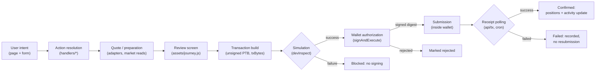

# Transaction flow

How a user intent becomes an on-chain result. Names in parentheses are the real code paths.

## Pipeline

Reviews expire after 60 seconds; a changed selection or wallet forces a rebuild.

## Step by step

1. **User intent.** The user fills a form (swap pair + amount, deposit asset + provider, exit selection, DeepBook order). Pages: `swap`, `deposit`, `manage`, `trade`.
2. **Action resolution.** The matching handler (`handlers/swap.js`, `handlers/journey.js`, `handlers/trade.js`, `handlers/earn.js`, `handlers/lending.js`, …) validates input with fail-closed errors (`INVALID_AMOUNT`, `NO_ROUTE`, `INVALID_MARKET`, …) and resolves provider, market, and obligations/tickets.
3. **Quote / preparation.** Swap routes are compared across venues (Cetus aggregator, Aftermath, Turbos) and ranked by effective output; lending/staking reads fetch live reserves, exchange rates, and caps. Anything unavailable aborts the flow with a named error.
4. **Review.** The frontend renders the full plan: you pay, minimum received, receipt asset, Noise fee + recipient, gas estimate, exit conditions, risks, and expiry. Nothing is hidden behind a single button label.
5. **Transaction build.** The backend assembles the Programmable Transaction Block and returns base64 `txBytes` plus an `expectedDigest`. For place-funds, swap + deposit share one PTB (atomic). The bytes are unsigned and unusable without the connected wallet.
6. **Simulation.** `devInspectTransactionBlock` runs the exact bytes against current chain state. Any non-success status blocks signing (`SIMULATION_FAILED`). Simulation cannot guarantee execution: liquidity, object versions, and balances can change between simulation and signing.
7. **Wallet authorization.** The frontend re-simulates, then calls the wallet's `signAndExecuteTransaction`. The wallet shows its own confirmation screen. The returned digest must equal `expectedDigest`; a mismatch is treated as untrusted and never resubmitted automatically.
8. **Submission.** Submission happens inside the wallet's `signAndExecute` call — the hub never relays a signed transaction.
9. **Confirmation / activity update.** The hub polls `sui_getTransactionBlock` (plus cron) until the digest reaches `confirmed` or `failed`, then refreshes balances/positions and appends the activity record. Rankings credit only receipts whose digest matches a prepared plan.

## Failures, rejections, expiry

| Situation | Handling |
|---|---|
| No route / insufficient liquidity | Named error before review; no bytes issued. |
| Simulation failure | Signing blocked; user must change input and rebuild. |
| Wallet rejection | Operation marked `rejected`; tracker stops. |
| Review older than 60 s, changed selection, or changed account | Plan discarded; rebuild required. |
| Digest differs from reviewed plan | Treated as untrusted; user inspects wallet history; no auto-resubmit. |
| On-chain failure | Recorded as `failed` with the chain error; gas may be charged; no silent retry. |

## Fees and referral accounting

Router swaps carry a 2 bps platform fee leg to the configured recipient, shown pre-sign with the recipient address. Earn/bridge/LP/DeepBook legs carry only protocol-side costs. Referral attribution (`?ref=`, 30-day window, personal-message consent) records revenue shares from hub revenue only — never as an extra user charge. No payouts are enabled (`PAYOUT_ENABLED=false`).

## What varies by provider

- **Journey deposits** (8 providers): atomic swap + deposit; mSUI mints direct from SUI only (SDK coin selection); Volo minimum 0.1 SUI; Haedal exits via ticket (delayed) or instant with fee.
- **Lending exits**: obligation health gates withdrawals; Kai redeems vault shares, not fixed amounts.
- **DeepBook**: orders require a user-owned BalanceManager; Predict mints settle through Predict wrappers.
- **STEAMM LP**: dual-asset deposits, advanced UI only.

## AI is not authorization

AI assistance (live-tools router, optional LLM) prepares text and triggers the same review pipeline. It holds no signing capability and its output never substitutes the wallet prompt. See [SECURITY-MODEL.md](SECURITY-MODEL.md).
